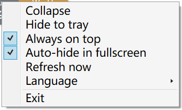

# Codex Usage Viewer

[中文](README.zh-CN.md) | English

A lightweight Windows floating widget that displays the remaining Codex 5-hour and weekly usage allowances through the official local `codex app-server`.

## Preview

<p align="center">
  
</p>

The compact widget expands on hover to reveal reset times and freshness details. After four seconds without interaction, it gently fades to 80% opacity so it stays visible without becoming distracting.

| Idle widget | Edge-dot mode | Widget menu |
| --- | --- | --- |
|  |  |  |

### Allowance colors

| Healthy | Warning | Low |
| --- | --- | --- |
|  |  |  |

## Features

- Separate remaining percentages and color states for the 5-hour and weekly limits
- Reset date/time details and relative last-update status
- Compact always-on-top pill with animated hover details
- Small two-color edge dot with a larger transparent click target
- Click, double-click, and drag gesture separation with left/right edge snapping
- Fullscreen auto-hide and system tray controls
- English, Simplified Chinese, and follow-system language modes
- Persistent position, dot mode, edge, opacity, topmost, fullscreen, language, and hint settings
- Startup, automatic, click, and tray refresh paths with a minimal local cache
- Local rotating diagnostics and no telemetry or automatic updater

## System requirements

- Windows 10 or Windows 11
- Windows PowerShell 5.1
- Windows .NET Framework 4.x WPF components
- The official `codex` command available on `PATH`
- A signed-in Codex/ChatGPT environment usable by `codex app-server`

## Download

Download `CodexUsageViewer.exe` from the [v2.0.0 release page](https://github.com/iieng6/codex-usage-viewer/releases/tag/v2.0.0).

The executable is portable and does not require installation. It is currently unsigned, so Windows SmartScreen may display a warning.

## Usage

Run `CodexUsageViewer.exe`. The widget loads its last successful cached values, if present, and requests current rate-limit data at startup. It refreshes automatically every 60 seconds.

The displayed percentage is `100 - usedPercent`. Green means at least 50% remains, amber means 20–49%, red means below 20%, white represents zero remaining, and gray represents unavailable data.

## Controls

- Hover over the widget to reveal reset details.
- Single-click the full widget to refresh usage data and show the last update time.
- Double-click the full widget to collapse it into a small edge dot.
- Single-click the dot to restore the full widget.
- Drag the widget to reposition it and snap it to the nearest screen edge.
- Right-click the widget or tray icon to open the menu.
- Use the tray icon menu or double-click the tray icon to restore a hidden widget.
- Change the language from the tray menu.

The menus provide show/expand/collapse, hide to tray, always-on-top, fullscreen auto-hide, refresh, language, and exit controls.

## Language switching

Choose **Language** in the widget or tray menu:

- **Follow system** uses Simplified Chinese for `zh-CN`, `zh-SG`, and `zh-Hans-*` Windows UI cultures; all other UI cultures use English.
- **简体中文** always uses Simplified Chinese.
- **English** always uses English.

Manual language choices are saved and applied immediately. English is the fallback for missing translations.

## Data and privacy

The application starts the official local command:

```text
codex app-server --stdio -c analytics.enabled=false
```

It sends fixed initialization messages and `account/rateLimits/read` over redirected standard input/output. It reads only rate-limit percentages, reset timestamps, window durations, the matching request ID, and protocol error state. It has no HTTP client, third-party endpoint, telemetry, analytics, or automatic update implementation.

Local files are stored under `%LOCALAPPDATA%\CodexUsageViewer`:

- `window-state.txt`: window and interaction preferences
- `usage-cache.json`: display-ready percentages, reset times, and last successful update time
- `CodexUsageViewer.log`: rotating local diagnostics
- `Program Network Audit.txt`: static privacy/network audit

Authentication remains inside the official `codex app-server`. Raw responses, cookies, tokens, authorization headers, prompts, conversations, and identity data are not persisted by this application. See [SECURITY.md](SECURITY.md).

## Troubleshooting

- Confirm `codex` is available on `PATH` and can start `codex app-server`.
- Confirm the relevant account is signed in through the official Codex environment.
- Use **Refresh now** from the widget or tray menu.
- If the widget is hidden, use **Show** or double-click the tray icon.
- Review `%LOCALAPPDATA%\CodexUsageViewer\CodexUsageViewer.log` for local diagnostics.
- Fullscreen auto-hide may vary with applications that use unusual overlay or borderless-window behavior.

## Build from source

This repository intentionally uses a lightweight .NET Framework build script and does not include a `.sln` or `.csproj`.

```powershell
powershell -ExecutionPolicy Bypass -File .\build.ps1
powershell -ExecutionPolicy Bypass -File .\tests\run-tests.ps1
```

The build script invokes the Windows .NET Framework C# compiler and writes `dist\CodexUsageViewer.exe`.

## Known limitations

- Windows only.
- The executable is unsigned.
- The official `codex` command and a valid signed-in environment are required.
- Fullscreen detection is based on the foreground window covering its monitor and may not recognize unusual fullscreen applications.
- No installer or automatic updater is included.

## License

Licensed under the [MIT License](LICENSE).

This is an independent open-source utility and is not affiliated with, endorsed by, or maintained by OpenAI.
