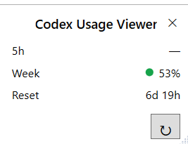

# Codex Usage Viewer

[English](README.md) | [中文](README.zh-CN.md)

<!-- GitHub description: A lightweight, local-first Windows widget for viewing ChatGPT Codex usage. -->
<!-- Suggested topics: codex, chatgpt, windows, desktop, widget, usage, quota, wpf, dotnet -->

## 项目介绍

一个轻量、本地优先的 Windows 悬浮窗，用于查看 ChatGPT Codex 剩余额度。项目强调隐私友好、只读和最小权限。

## 功能

- 小型、无系统标题栏、始终置顶的 WPF Widget
- WPF 原生绿、黄、红剩余额度状态
- 动态额度窗口与重置倒计时
- 启动刷新、手动刷新和加载状态
- 支持拖动、调整大小并记住窗口位置与尺寸
- 关闭到托盘，提供 Show、Refresh、About、Exit
- 不包含 Telemetry、Analytics、自动更新或后台自动刷新

## 截图



## 系统要求

- Windows 10 或 Windows 11
- 已安装官方 Codex，且 `codex` 可通过 `PATH` 使用
- 已通过 Codex 登录 ChatGPT 账号
- Windows .NET Framework 与 WPF 组件

## Build

本项目从设计开始就采用轻量构建方式，不依赖 Visual Studio `.sln` 或 SDK-style `.csproj`。`build.ps1` 是唯一构建入口；这是有意的设计选择，并非仓库遗漏了工程文件。

构建脚本会：

- 自动收集 `src` 下全部 `.cs` 文件
- 调用 Windows 自带的 .NET Framework `csc.exe`
- 自动引用项目所需程序集
- 输出最终可执行文件

从源码构建：

```powershell
git clone <repository-url>
cd codex-usage-viewer
powershell -ExecutionPolicy Bypass -File .\build.ps1
```

如果未来需要支持 Visual Studio 或 `dotnet build`，将在后续版本中迁移到标准 SDK 项目结构。

## 使用方法

运行 `dist\CodexUsageViewer.exe`。程序启动时刷新一次；使用 `↻` 刷新，使用 `✕` 隐藏到系统托盘，并通过托盘菜单执行 Show、Refresh、About 或 Exit。

界面显示 `100 - usedPercent`。剩余至少 50% 为绿色，20～49% 为黄色，低于 20% 为红色。当 `secondary == null` 时，短周期显示 `5h —`。

## 技术架构

```text
MainWindow / TrayController
          ↓
     UsageService
          ↓
 DesktopUsageProvider
          ↓
official codex app-server
          ↓
account/rateLimits/read
```

UI 不知道数据来源；App Server 通信与解析全部集中在 `DesktopUsageProvider`。

## 隐私

- 唯一业务请求是 `account/rateLimits/read`。
- 身份验证完全由官方 `codex app-server` 管理。
- 不访问 Cookie、Token、聊天、Prompt、浏览器、用户资料、Credential、剪贴板或用户文件。
- 不包含直接 HTTP 客户端、第三方地址、Telemetry、Analytics、服务、计划任务、开机启动、注册表修改或权限提升。
- Usage 响应只存在于内存，仅持久化窗口配置和固定 Program Network Audit。

完整审计见 [SECURITY.md](SECURITY.md)。

## License

本项目采用 [MIT License](LICENSE)。

## 免责声明

本项目是独立的开源工具，与 OpenAI 无关联，未经 OpenAI 认可，也不由 OpenAI 维护。

“ChatGPT”、“Codex”及相关名称是 OpenAI 的商标。
